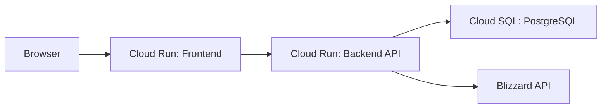
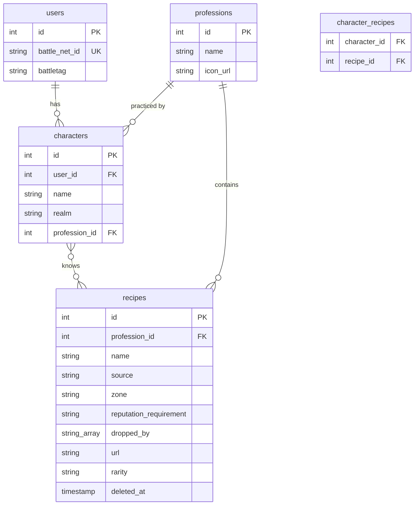

# PRD: WoW Guild Profession Recipe Tracker

## 1. Introduction / Overview

Many rare profession recipes in World of Warcraft: Burning Crusade Anniversary are difficult to obtain -- they drop from specific bosses, require high reputation, or come from obscure vendors. When a guild member needs something crafted, there is no easy way to know who in the guild has learned a particular recipe.

This app is a lightweight web tool for a single WoW BC Anniversary guild to track which members have rare profession recipes. Guild members log in with their Battle.net account, select a character, and check off the recipes they know — either manually or by importing from the in-game ProfessionExporter addon. Anyone — guild member or not — can browse the list of recipes and see who can craft what, without needing to log in.

The project is designed to be self-hostable on Google Cloud via Terraform, so other guilds can fork the repo and deploy their own instance.

## 2. Goals

1. **Make rare crafters discoverable.** Any visitor can search for a recipe and immediately see which guild members can craft it.
2. **Make recipe registration fast and frictionless.** An authenticated guild member should be able to mark all their known recipes in under two minutes.
3. **Keep the recipe list maintainable.** The curated list of tracked recipes lives in static JSON files in the repo, making it easy to review, version, and update via pull requests.
4. **Enable easy self-hosting.** A new guild should be able to fork the repo and deploy to their own GCP project using Terraform with minimal manual configuration.

## 3. User Stories

### 3.1 Public Visitor (no login required)

- **As a visitor**, I want to pick a profession from a list so I can see all tracked rare recipes for that profession.
- **As a visitor**, I want to search/filter within a profession's recipe list so I can quickly find a specific recipe.
- **As a visitor**, I want to see which characters know a given recipe (character name, realm) so I can whisper them in-game.

### 3.2 Authenticated Guild Member

- **As a guild member**, I want to log in with my Battle.net account so I don't need to create a separate username/password.
- **As a guild member**, I want to see my WoW characters pulled from the Blizzard API so I can pick the one I want to add recipes for.
- **As a guild member**, I want to select which profession my character has so the app shows the correct recipe checklist.
- **As a guild member**, I want to check/uncheck recipes on the list to indicate which ones my character knows, and have those selections saved immediately.
- **As a guild member**, I want to manage recipes for multiple characters (e.g., an alchemist alt and an enchanter main).
- **As a guild member**, I want to import my known recipes from the ProfessionExporter addon so I can quickly sync my in-game recipe list without toggling each one manually.

### 3.3 Repo Maintainer

- **As a repo maintainer**, I want to add or remove recipes by editing JSON files in the repository so I don't need an admin UI.
- **As a repo maintainer**, I want each recipe entry to include the recipe name, source, zone, and reputation requirement so that the app can display helpful context to visitors.

## 4. Functional Requirements

### Authentication

1. The app must support Battle.net OAuth 2.0 login.
2. On successful login, the app must create or update a user record with the user's Battle.net ID and BattleTag.
3. The app must support logging out, which clears the user's session.
4. All recipe-editing actions (checking/unchecking recipes) must require authentication.

### Character Selection

5. After login, the app must fetch the user's WoW Classic character list from the Blizzard API.
6. The app must display the character list and let the user select which character to manage.
7. If the Blizzard API does not return character data (e.g., API limitations for BC Anniversary), the app must fall back to letting the user manually enter a character name and realm.
8. A user must be able to manage multiple characters across separate sessions or from a character-switcher UI.
9. Character selection must be restricted to characters in the configured guild, controlled by a backend environment variable `GUILD` (default `Red Sun`).
10. The character dropdown must only show characters that match the configured guild filter.

### Profession Selection

11. After selecting a character, the user must choose which profession that character has from the list of TBC professions (Alchemy, Blacksmithing, Enchanting, Engineering, Jewelcrafting, Leatherworking, Tailoring, Cooking).
12. The selected profession is stored with the character record so it persists across sessions.

### Recipe Checklist (Authenticated)

13. After selecting a character and profession, the app must display the curated list of rare recipes for that profession.
14. Each recipe in the list must show: recipe name (linked to Wowhead if URL is available), source (e.g., drop, vendor, quest, reputation), zone, reputation requirement (if applicable), rarity (if available), and dropped-by enemies (if applicable).
15. The user must be able to toggle individual recipes on/off to indicate whether their character knows them.
16. Toggling a recipe must persist the change to the database immediately (optimistic UI update with server confirmation).
17. The addon import flow must sync the character's known recipes for the selected profession: add matched recipes and remove previously known recipes for that same profession that are absent from the latest import.
18. After addon import, the confirmation UI must show which recipes were successfully matched/imported.
19. Addon recipe import must be allowed only for characters that are in the configured guild (`GUILD`).

### Public Browse & Search

20. The app must display a profession picker on the home page (accessible without login).
21. After selecting a profession, the app must display all tracked recipes for that profession.
22. Each recipe row must show: recipe name, source, zone, reputation requirement, dropped-by enemies (if any), and a list of character names who know it.
23. The app must provide a search/filter input that filters the recipe list by recipe name in real time (client-side filtering).
24. When a user is logged in and has a character selected, the app must show a "Known only" toggle next to the search input that filters the recipe list to only recipes that character knows. The toggle must not be visible to logged-out users or when no character is selected. Switching characters must reset the toggle and refresh the checklist data.
25. If no characters know a recipe, the row must still appear but indicate that no crafters are available.

### Recipe Seed Data

26. Recipe data must be stored in static JSON files in the repository, organized by profession (e.g., `data/recipes/alchemy.json`).
27. Each recipe entry in the JSON must include: `name` (string, without profession prefix like "Recipe:" or "Plans:"), `source` (enum: drop, vendor, quest, reputation), `zone` (string), `reputation_requirement` (string, nullable), `dropped_by` (array of strings, nullable — enemy types that drop the recipe), `url` (string, nullable — Wowhead link), and `rarity` (string, nullable — item rarity).
28. A database seed/migration script must load these JSON files into the database on deployment or when recipe data changes.

## 5. Non-Goals (Out of Scope)

- **No in-app admin UI** for managing the recipe list. Recipes are maintained via JSON files in the repo.
- **No multi-guild support.** This deployment serves a single guild. Other guilds fork and deploy their own.
- **No automatic recipe detection** from the Blizzard API. The BC Anniversary API may not expose learned recipes; users self-report.
- **No crafting request or queue system.** The app only tracks who knows what; coordination happens in-game.
- **No chat or messaging features.**
- **No guild-officer admin role.** Repo access is the only admin mechanism.

## 6. Design Considerations

- **Dark theme with gold accents** to evoke the WoW aesthetic. Keep it simple and readable.
- **Mobile-friendly responsive layout.** Guild members will often check this on their phones while playing.
- **Profession icons** displayed on the profession picker for quick visual identification.
- **Search bar placed above the recipe table** on each profession page, with a "Known only" filter toggle visible when a character checklist is active.
- **Checklist UI** for the authenticated recipe management view -- checkboxes with recipe names and metadata, easy to scan and toggle quickly.

## 7. Technical Considerations

### Architecture

### Tech Stack

- **Frontend:** React + TypeScript + Vite. Served as a static build from Cloud Run (or a Cloud Storage bucket behind a load balancer).
- **Backend:** Node.js + TypeScript + Express. REST API. Deployed to Cloud Run.
- **Addon:** ProfessionExporter — a WoW TBC Anniversary addon that exports known recipes to JSON via `/exportrecipes` for import into the web app.
- **Database:** Cloud SQL PostgreSQL (smallest tier). Stores users, characters, professions, recipes, and the character-recipe join data.
- **Auth:** Battle.net OAuth 2.0. The backend handles the OAuth flow and issues a session cookie or JWT to the frontend.
- **Infrastructure:** Terraform, provisioning Cloud Run services, Cloud SQL instance, IAM roles, and Secret Manager entries for Battle.net client credentials.

### Data Model

### Key Technical Notes

- **Blizzard API fallback:** The app should gracefully handle the case where the Blizzard API does not return BC Anniversary character data. If the character list endpoint returns empty or errors, present a manual character-name/realm input form instead.
- **Guild filter:** Character import/filtering must use an environment variable `GUILD` and Blizzard's guild roster API to constrain the character selector to one guild per deployment.
- **Blizzard namespace:** Profile and roster API calls should use the BC Anniversary namespace `profile-classicann-us`.
- **Recipe seeding:** On deploy, a migration script reads the JSON files from `data/recipes/` and upserts them into the `recipes` table. Recipes removed from the JSON are soft-deleted (or flagged) so that historical character-recipe links are not lost.
- **CORS:** The frontend and backend may run on different Cloud Run URLs. Configure CORS on the backend to allow the frontend origin.
- **Secrets:** Battle.net OAuth client ID and secret must be stored in GCP Secret Manager and injected into the backend Cloud Run service as environment variables via Terraform.

### Terraform Modules

The Terraform configuration should provision:

- Cloud Run service for the backend API
- Cloud Run service (or Cloud Storage bucket + LB) for the frontend
- Cloud SQL PostgreSQL instance (db-f1-micro or db-g1-small)
- Secret Manager secrets for Battle.net credentials
- IAM bindings (Cloud Run invoker, Cloud SQL client, Secret Manager accessor)
- VPC connector for Cloud Run to reach Cloud SQL via private IP

## 8. Success Metrics

- **Registration speed:** A guild member can log in, select a character, and mark all their known recipes in under 2 minutes.
- **Lookup speed:** A public visitor can find which characters know a specific recipe in under 30 seconds.
- **Deployment success:** A fresh fork can be deployed to a new GCP project via `terraform apply` with only Battle.net credentials and a GCP project ID as required inputs.
- **Adoption:** At least 50% of active guild crafters register their recipes within the first two weeks of launch.

## 9. Open Questions

1. **Blizzard API coverage for BC Anniversary:** Does the WoW Classic Character Profile API return characters on BC Anniversary realms? If not, the character selection flow will need to fall back entirely to manual entry. This should be verified early in development by testing the API with a BC Anniversary account.
